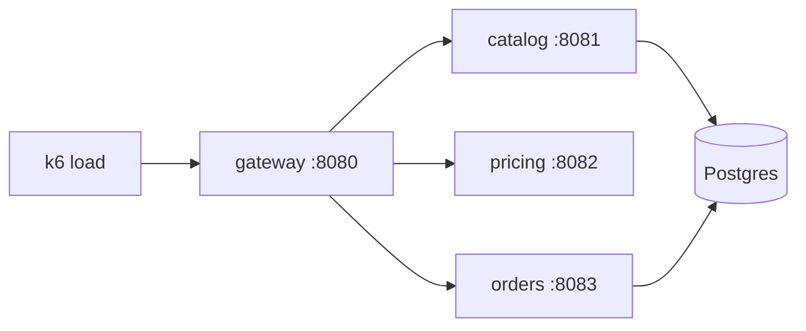

# Bloom

Bloom is a small online flower shop, built as Spring Boot microservices. It exists to
have a realistic, multi-service Java application to profile and troubleshoot.

## Architecture



| Service   | Port | What it does                                                        |
|-----------|------|---------------------------------------------------------------------|
| `gateway` | 8080 | Storefront UI + public API: API-key auth, browse/search proxy, checkout orchestration |
| `catalog` | 8081 | Product catalog and reviews, seeded with 6000 products (Postgres)   |
| `pricing` | 8082 | Quote engine: applies the best combination of 400 generated promotions |
| `orders`  | 8083 | Order intake, plain-text receipts, audit trail (Postgres)           |

All services run with the OpenTelemetry Java agent plus the Pyroscope OTel extension:
traces go to an OTLP endpoint, continuous profiles (CPU, alloc, lock) go to
Pyroscope, and trace spans are linked to profile samples (span profiles).

## Running it

Requirements: Docker with Compose.

```sh
cp .env.example .env    # fill in Grafana Cloud endpoints + credentials
make up                 # build and start everything
make load               # run the k6 checkout/browse/search mix (LOAD_DURATION in .env)
make smoke              # one-shot request against each endpoint
make down
```

For a fully local run without Grafana Cloud — profiles go to a bundled
Pyroscope (http://localhost:4040), traces to a bundled Tempo, both browsable
in a bundled Grafana at http://localhost:3000 (anonymous access, no login):

```sh
cp .env.local .env
make up-local
```

The first `catalog` start seeds the database; it is ready when
`docker compose logs catalog` prints `seeded 6000 products`.

## Storefront

The shop UI is served by the gateway at http://localhost:8080 — browse, search,
basket, checkout, and receipts, all against the same API the load generator uses.
It is plain HTML/CSS/JS under `gateway/src/main/resources/static/`.

## API

All `/shop` requests need the demo API key header: `X-Api-Key: bloom-demo-key`.

```sh
curl -H 'X-Api-Key: bloom-demo-key' 'localhost:8080/shop/products?page=0&size=5'
curl -H 'X-Api-Key: bloom-demo-key' 'localhost:8080/shop/search?q=rose'
curl -H 'X-Api-Key: bloom-demo-key' -H 'Content-Type: application/json' \
  -d '{"customerId":"c-1","customerTier":"GOLD","items":[{"productId":1,"quantity":2}]}' \
  'localhost:8080/shop/checkout'
curl -H 'X-Api-Key: bloom-demo-key' 'localhost:8080/shop/orders/1/receipt'
```

## Telemetry

- `service_name`: `bloom-gateway`, `bloom-catalog`, `bloom-pricing`, `bloom-orders`
- Profile types: CPU (`itimer`), allocations (in new TLAB), lock contention
- Pricing adds dynamic code-level labels to its profiles: `customer_tier`, `cart_size`
- Agent jars are baked into the image; versions are pinned in the `Dockerfile`.
  The Pyroscope agent runs as a `-javaagent` and starts the profiler; the OTel
  extension handles span-to-profile correlation only.
