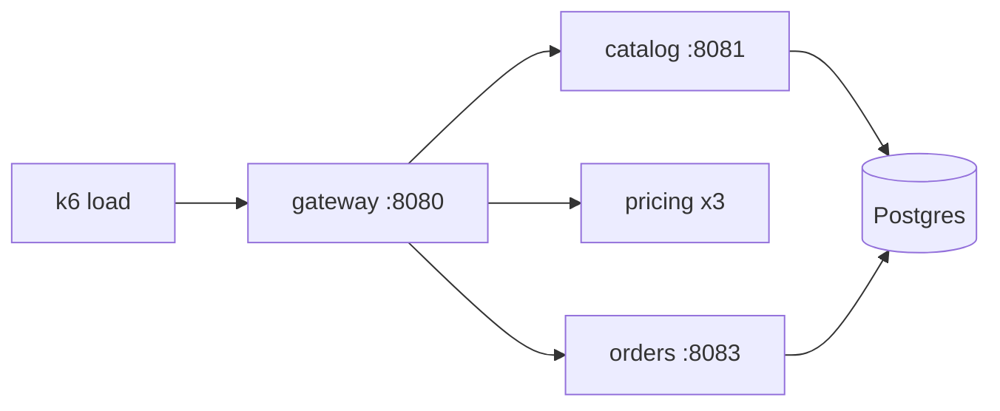

# Bloom

Bloom is a small online flower shop, built as Spring Boot microservices. It exists to
have a realistic, multi-service Java application to profile and troubleshoot.

It is the same app as in the 2026-07 call, with the surrounding Compose stack
rewired: everything — app, load, Pyroscope, Tempo and Grafana — comes up
together, locally, with no Grafana Cloud credentials needed.

## Architecture



| Service   | Port | What it does                                                        |
|-----------|------|---------------------------------------------------------------------|
| `gateway` | 8080 | Storefront UI + public API: API-key auth, browse/search proxy, checkout orchestration |
| `catalog` | 8081 | Product catalog and reviews, seeded with 6000 products (Postgres)   |
| `pricing` | —    | Quote engine: applies the best combination of 400 generated promotions. Three replicas, reached through Compose DNS round-robin |
| `orders`  | 8083 | Order intake, plain-text receipts, audit trail (Postgres)           |

All services run with the OpenTelemetry Java agent plus the Pyroscope OTel extension:
traces go to Tempo, continuous profiles (CPU, alloc, lock) go to Pyroscope, and
trace spans are linked to profile samples (span profiles).

## Running it

Requirements: Docker with Compose.

```sh
make up      # build and start everything, including the load generator
make ps
make smoke   # one-shot request against each endpoint
make down
```

| What                | Where                                                          |
|---------------------|-----------------------------------------------------------------|
| Profiles Drilldown  | http://localhost:3000/a/grafana-pyroscope-app/explore            |
| Grafana             | http://localhost:3000 — anonymous Admin; sign in as `admin`/`bloom` if you need Explore |
| Storefront          | http://localhost:8080                                            |
| Pyroscope           | http://localhost:4040                                            |
| Tempo               | http://localhost:3200                                            |

The first `catalog` start seeds the database; it is ready when
`docker compose logs catalog` prints `seeded 6000 products`.

The k6 load generator starts with the stack and keeps running (12 h per run,
then Compose restarts it). No `make load` step any more.

Nothing needs a `.env`. Copy `.env.example` to `.env` only to change the load
profile or to point telemetry at a Grafana Cloud stack instead.

## Component versions

Pinned to the latest releases as of the call:

| Component | Version  | Why pinned                                              |
|-----------|----------|---------------------------------------------------------|
| Grafana   | 13.1.3   | Carries both features, and preinstalls Profiles Drilldown 2.2.0, which wires them up |
| Pyroscope | 2.2.1    | Serves `SelectHeatmap`; run with `-architecture.storage=v2` |
| Tempo     | 3.0.2    | `latest` on Docker Hub still points at an older build     |
| k6        | 2.2.0    |                                                          |

## Storefront

The shop UI is served by the gateway at http://localhost:8080 — browse, search,
basket, checkout, and receipts, all against the same API the load generator uses.
It is plain HTML/CSS/JS under `gateway/src/main/resources/static/`.

## API

All `/shop` requests need the demo API key header: `X-Api-Key: bloom-demo-key`.

```sh
curl -H 'X-Api-Key: bloom-demo-key' 'localhost:8080/shop/products?page=0&size=5'
curl -H 'X-Api-Key: bloom-demo-key' 'localhost:8080/shop/search?q=rose'
curl -H 'X-Api-Key: bloom-demo-key' -H 'Content-Type: application/json' \
  -d '{"customerId":"c-1","customerTier":"GOLD","items":[{"productId":1,"quantity":2}]}' \
  'localhost:8080/shop/checkout'
curl -H 'X-Api-Key: bloom-demo-key' 'localhost:8080/shop/orders/1/receipt'
```

## Telemetry

- `service_name`: `bloom-gateway`, `bloom-catalog`, `bloom-pricing`, `bloom-orders`
- Profile types: CPU (`itimer`), allocations (in new TLAB), lock contention
- Pricing adds dynamic code-level labels to its profiles: `customer_tier`, `cart_size`
- Agent jars are baked into the image; versions are pinned in the `Dockerfile`.
  The Pyroscope agent runs as a `-javaagent` and starts the profiler; the OTel
  extension handles span-to-profile correlation only.
